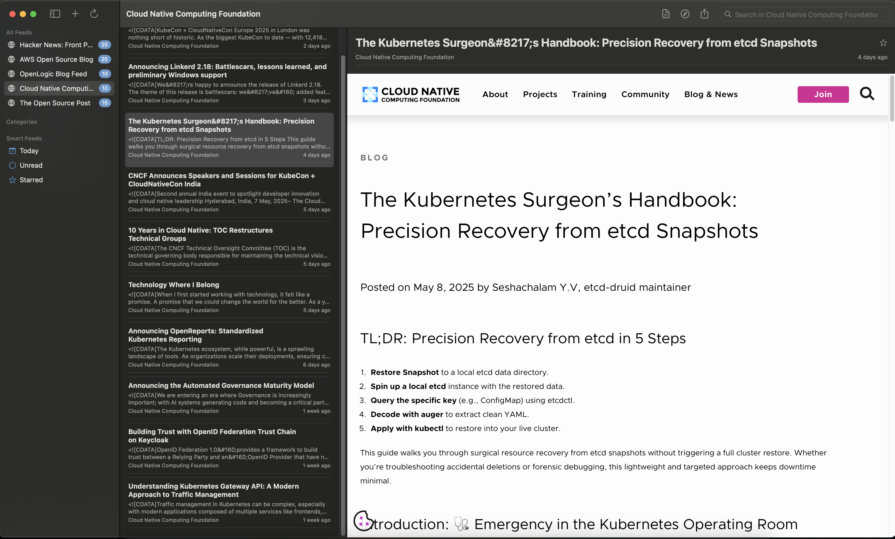

# BlackDuck

BlackDuck 是一个现代化的 macOS 应用程序，使用 SwiftUI 构建，用于聚合和显示来自各种网站和社交平台的内容。它提供了一个简洁、直观的界面，让您可以在一个地方查看和分析来自多个来源的内容。



## 功能特点

- 添加和管理多个网站源（RSS、Atom 等）
- 自动获取和解析内容
- 使用 SwiftUI 构建的美观、原生 macOS 界面
- 支持 HTML 内容的丰富显示
- 内容过滤和组织功能
- 支持深色模式和其他系统集成
- 可自定义的刷新间隔和通知设置

## 技术实现

- **SwiftUI**: 用于构建现代化、响应式的用户界面
- **Combine**: 用于响应式数据流和状态管理
- **Async/Await**: 用于异步网络请求和内容解析
- **WKWebView**: 用于渲染 HTML 内容
- **NSViewRepresentable**: 用于在 SwiftUI 中集成 AppKit 组件
- **UserDefaults**: 用于保存用户设置和订阅源

## 项目结构

```bash
BlackDuck/
├── Models/          # 数据模型
│   └── FeedModel.swift
├── Views/           # UI 组件
│   ├── ContentView.swift
│   ├── DetailView.swift
│   ├── FeedItemView.swift
│   ├── HTMLContentView.swift
│   └── SidebarView.swift
├── Managers/        # 业务逻辑
│   └── FeedManager.swift
├── Utilities/       # 工具类
│   └── WebContentParser.swift
└── BlackDuckApp.swift  # 应用入口
```

## 系统要求

- macOS 12.0+
- Xcode 14.0+
- Swift 5.7+

## 安装方法

1. 克隆仓库

   ```bash
   git clone https://github.com/yourusername/BlackDuck.git
   ```

2. 打开 Xcode 项目

   ```bash
   cd BlackDuck
   open BlackDuck.xcodeproj
   ```

3. 构建并运行应用程序

## 使用方法

1. 启动应用后，点击工具栏中的 "+" 按钮添加新的订阅源
2. 输入 RSS/Atom 订阅源的 URL（例如 `https://hnrss.org/frontpage`）
3. 在左侧边栏中选择订阅源查看其内容
4. 点击文章标题查看详细内容
5. 使用 "星标" 功能标记重要文章
6. 在设置中自定义刷新间隔和其他选项

## 未来计划

- [ ] 支持更多的订阅源格式
- [ ] 添加文章导出和分享功能
- [ ] 实现全文搜索功能
- [ ] 添加自定义分类和标签
- [ ] 支持离线阅读

## 贡献指南

欢迎提交 Pull Request 或创建 Issue 来帮助改进这个项目。

## 许可证

[MIT 许可证](LICENSE)
