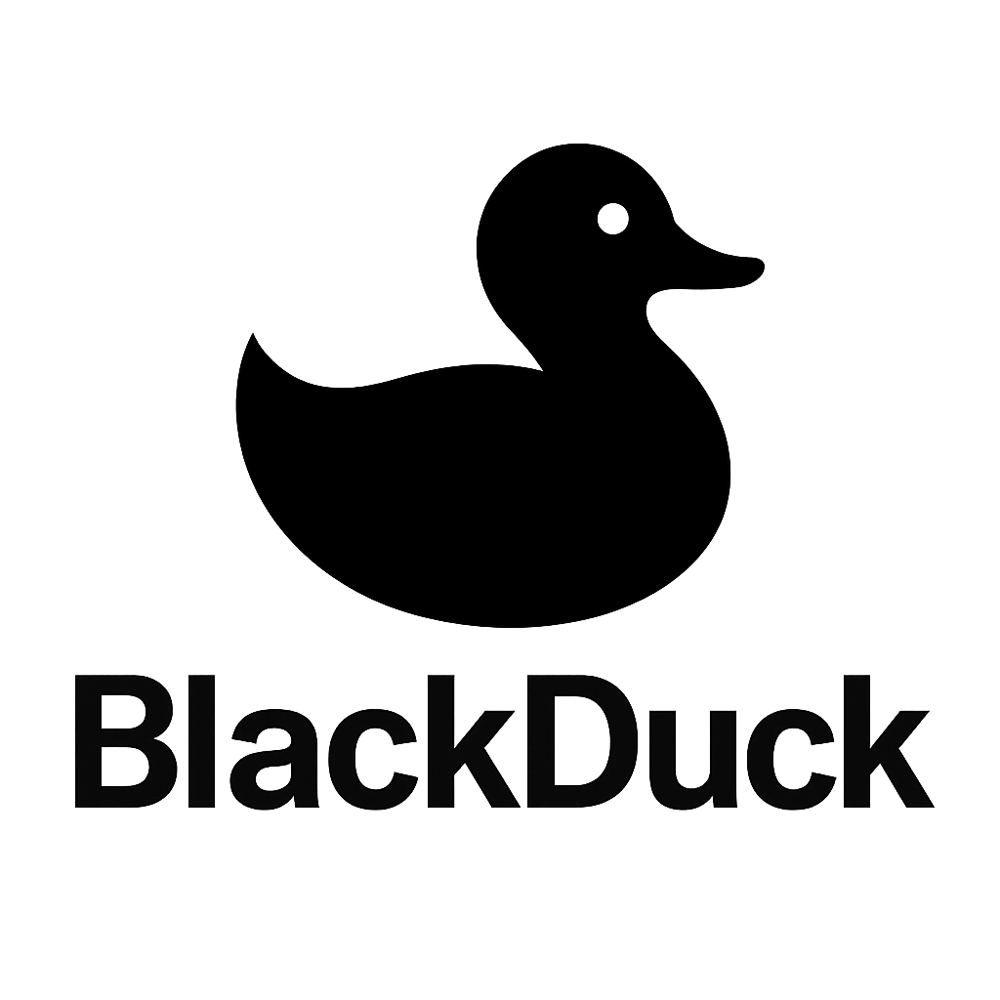

<div align="center">
  
  <h1>BlackDuck</h1>
</div>

<p align="center">
  <a href="https://swift.org"></a>
  <a href="https://developer.apple.com/macos/"></a>
  <a href="https://github.com/deadjoe/BlackDuck/blob/main/LICENSE"></a>
  <a href="https://github.com/deadjoe/BlackDuck/releases"></a>
  <a href="https://github.com/deadjoe/BlackDuck/actions"></a>
  <a href="https://github.com/deadjoe/BlackDuck/stargazers"></a>
</p>

BlackDuck 是一个现代化的 macOS 应用程序，使用 SwiftUI 构建，用于聚合和显示来自各种网站的 RSS 和 Atom 订阅源内容。它提供了一个简洁、直观的界面，让您可以在一个地方查看和管理来自多个来源的文章和新闻。


## 功能特点

- 添加和管理多个网站源（RSS、Atom 等）
- 自动获取和解析内容，定时刷新
- 使用 SwiftUI 构建的美观、原生 macOS 界面
- 支持 HTML 内容的丰富显示
- 智能分类（今日、未读、星标）和搜索功能
- 支持深色模式和系统集成
- 可自定义的刷新间隔
- 文章标星功能，方便保存重要内容
- 支持在原始网页和解析内容之间切换

## 技术实现

- **SwiftUI**: 用于构建现代化、响应式的用户界面
- **Combine**: 用于响应式数据流和状态管理
- **Async/Await**: 用于异步网络请求和内容解析
- **WKWebView**: 用于渲染 HTML 内容和显示原始网页
- **NSViewRepresentable**: 用于在 SwiftUI 中集成 AppKit 组件
- **UserDefaults**: 用于保存用户设置和订阅源
- **ObservableObject**: 用于状态管理和视图更新
- **NavigationSplitView**: 用于实现三栏式导航界面
- **XML 解析**: 用于处理 RSS 和 Atom 订阅源

## 项目结构

```bash
BlackDuck/
├── Models/          # 数据模型
│   └── FeedModel.swift
├── Views/           # UI 组件
│   ├── ContentView.swift
│   ├── DetailView.swift
│   ├── FeedItemView.swift
│   ├── HTMLContentView.swift
│   └── SidebarView.swift
├── Managers/        # 业务逻辑
│   └── FeedManager.swift
├── Utilities/       # 工具类
│   └── WebContentParser.swift
└── BlackDuckApp.swift  # 应用入口
```

## 系统要求

- macOS 14.0+
- Xcode 15.0+
- Swift 5.7+

## 安装方法

1. 克隆仓库

   ```bash
   git clone https://github.com/deadjoe/BlackDuck.git
   ```

2. 打开 Xcode 项目

   ```bash
   cd BlackDuck
   open BlackDuck.xcodeproj
   ```

3. 构建并运行应用程序（⌘+R）

## 使用方法

1. 启动应用后，点击工具栏中的 "+" 按钮添加新的订阅源
2. 输入 RSS/Atom 订阅源的 URL（例如 `https://hnrss.org/frontpage`）
3. 在左侧边栏中选择订阅源或智能分类（今日、未读、星标）查看内容
4. 在中间栏中点击文章标题查看详细内容
5. 使用星标按钮（⭐）标记重要文章
6. 使用搜索框搜索特定内容
7. 点击工具栏中的刷新按钮（🔄）手动更新订阅源
8. 使用切换按钮在解析内容和原始网页之间切换

## 未来计划

- [ ] 支持更多的订阅源格式（JSON Feed、微信公众号等）
- [ ] 添加文章导出和分享功能
- [ ] 实现全文搜索功能
- [ ] 添加自定义分类和标签
- [ ] 支持离线阅读
- [ ] 添加阅读统计和分析功能
- [ ] 支持文章内容翻译
- [ ] 实现跨设备同步（iCloud）
- [ ] 添加更多自定义主题

## 贡献指南

欢迎提交 Pull Request 或创建 Issue 来帮助改进这个项目。

1. Fork 这个仓库
2. 创建您的特性分支 (`git checkout -b feature/amazing-feature`)
3. 提交您的更改 (`git commit -m 'Add some amazing feature'`)
4. 推送到分支 (`git push origin feature/amazing-feature`)
5. 创建一个 Pull Request

## 测试

项目包含单元测试，确保核心功能正常工作：

```bash
# 运行所有测试
xcodebuild test -scheme BlackDuck -destination "platform=macOS"
```

## 许可证

本项目采用 [MIT 许可证](LICENSE) 进行许可。
